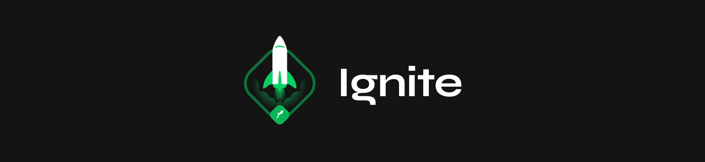

# Ignite Trilha React - Desafio 01



<h3 align="center">
  Conceitos do React
</h3>

<p align="center">
  

  

  
</p>

## :rocket: Sobre o desafio

Desafio para demonstração dos conceitos básicos de ReactJs: componentes, estado, imutabilidade.

Para isso foi criada uma todo list com as funções:

- Adicionar novo item na lista;
- Marcar um item na lista como completo;
- Excluir item da lista;

### :keyboard: Instalação e Execução

- Clonar o repositório

```
> git clone https://github.com/holymos/rocketseat-ignite-desafio01
```

- Entrar no diretório do projeto

```
> cd rocketseat-ignite-desafio01
```

- Instalar as dependências com o Yarn ou npm

```
yarn  ||  npm i
```

- Rodar a suite de testes

```
yarn test  ||  npm test
```

- Executar o projeto

```
yarn dev  ||  npm run dev
```
